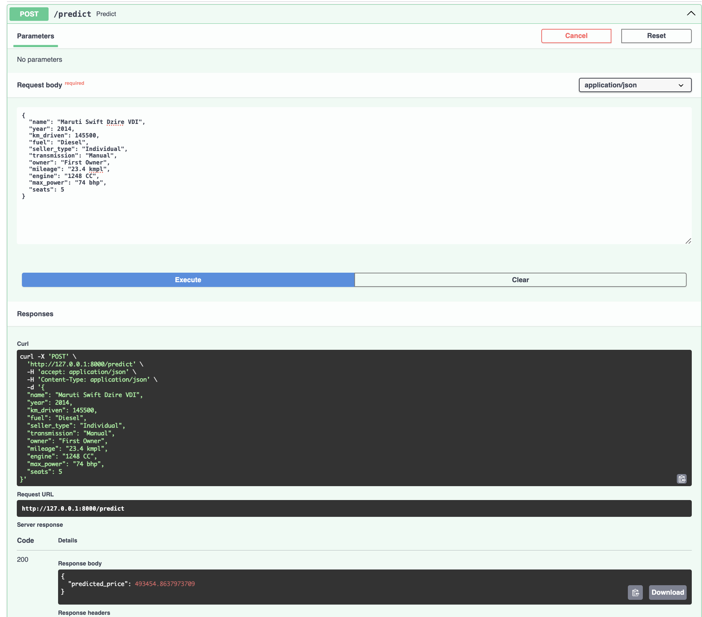

# Отчёт по HW1

## Что было сделано

1. Обработка признаков:
   - Очищение пропусков.
   - Удаление дубликатов.
   - Преобразование строковых признаков.

2. Проведена визуализация данных.

3. Обучены модели регрессии (линейная, Ridge, Lasso, ElasticNet) с различными подборками параметров с помощью GridSearchCV.

4. Создан и протестирован FastAPI-сервис для инференса модели c поддержкой JSON и CSV.

5. Создана и проверена кастомная метрика.

## С какими результатами

- Ridge регрессия показала лучшие метрики $R^2$ и MSE, тоже самое по кастомной метрике(предсказываем точно приблительно каждую вторую стоимость)

## Что дало наибольший буст в качестве

1. Обработка строковых признаков.
2. Подбор гиперпараметров с помощью GridSearchCV.

## Что сделать не вышло и почему

1. **Ошибка в FastAPI-сервисе:**
   - Ошибка при инференсее, причина в расхождении списков признаков между теми, что было подано модели в момент обучения, и фичами после обработки JSON/CSV. **Решение**: Переход на Pipeline.

2. **Время на дебаг:**
   - В ноутбуке был допущен ряд ошибок, которые было тяжело выявить, например, неудаленной столбец name.

